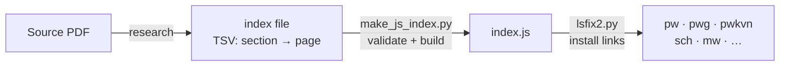

# CLAUDE.md

This file provides guidance to Claude Code (claude.ai/code) when working with code in this repository.

## Project Overview

PWK is a corrections and enhancements repository for the Cologne digitization of Böhtlingk's *Sanskrit-Wörterbuch in kürzerer Fassung* (Petersburg, 1879–1889), a 7-volume abridged Sanskrit dictionary. The canonical source data lives in `csl-orig/v02/pw/pw.txt`. This repo holds tooling, issue-specific correction workflows, and derived files.

The assumed local directory layout (adjust `$BASE` to your installation):
```
$BASE/sanskrit-lexicon/
  PWK/          ← this repo
$BASE/cologne/
  csl-orig/     ← source data (pw.txt lives at v02/pw/pw.txt)
  csl-pywork/   ← build tools
```

## Architecture

| Directory | Purpose |
|---|---|
| `pw_ls/` | Bibliography and literary-source analysis: `pwbib*.txt` tables, `crefmatch.py`, fuzzy-match pipelines |
| `pwkissues/` | One folder per GitHub issue (`issueNNN/` for analysis + correction scripts) |
| `abbrev/` | General abbreviation (`<ab>`) markup pipeline |
| `convertwork/` | SLP1 ↔ HK transcoding utilities |
| `verbs01/` | PW verb identification and correlation with MW verbs |
| `pwkvn/` | PWKVN (variant supplement) data — `step0/`, `step1/`, `install/` |
| `vn-sch/` | VN vs. Schmidt comparison and correction work |
| `pw_iast/` | IAST transcoding of pw.txt |

### Issue correction pattern (`pwkissues/issueNNN/`)

Each issue folder follows the same workflow:
1. Copy current `pw.txt` to a local `temp_pw_0.txt` (not tracked by git)
2. Apply corrections incrementally as `temp_pw_1.txt`, `temp_pw_2.txt`, etc.
3. Rebuild XML with `generate_dict.sh` and validate with `xmlchk_xampp.sh`
4. Commit the corrected file to `csl-orig`, then sync to Cologne
5. Commit issue documentation files back here

### Link-target pipeline (`pwkissues/issueNNN/`)

Literary-source link targets follow this flow:



### Bibliography cross-reference pipeline (`pw_ls/pwbib/`)

Sequential scripts refine `<ls>` tags and bibliography:
- `crefmatch.py` — match correction references against bibliography
- `pwbib1.py` — parse and update `pwbib1.txt`
- `fuzzymatch1/` and `fuzzywork/` — fuzzy matching for unresolved refs

`bibminuscref.txt` and `crefminusbib.txt` are the two gap files driving the correction series (issues #18–#59).

## Common Commands

### Apply line-level corrections
```bash
python updateByLine.py <input_file> <changein_file> <output_file>
```
Change file format: paired lines `NNN old <original>` / `NNN new <replacement>`. Lines starting with `;` are comments.

### Rebuild and validate XML (from `csl-pywork/v02/`)
```bash
cp temp_pw_N.txt $BASE/cologne/csl-orig/v02/pw/pw.txt
cd $BASE/cologne/csl-pywork/v02
sh generate_dict.sh pw  ../../pw
sh xmlchk_xampp.sh pw
```

### Bibliography pipeline (from `pw_ls/pwbib/`)
```bash
python crefmatch.py pw.txt pwbib0.txt crefmatch_log.txt
python pwbib1.py pwbib1.txt pwbib1_out.txt
```

### Abbreviation markup (from `abbrev/` or `pwkissues/issue88/`)
```bash
python unmarked_ab.py pw.txt pwab_input.txt freq_ab.txt
python change_althws.py ...
python updateByLine.py temp_pw_0.txt change_1.txt temp_pw_1.txt
```

## Dependencies

- **Python 3**
- **lxml** — XML parsing (`pip install lxml`)
- **pw.txt** — in `$BASE/cologne/csl-orig/v02/pw/pw.txt`

## GitHub Issue Conventions

### Milestones and projects

Every issue belongs to exactly one milestone, which mirrors an org-level kanban project:

| Milestone | Project | Scope |
|---|---|---|
| Dictionary to Book (1) | Project 1 | Link targets and link splitting |
| Digitization Quality (2) | Project 2 | Scan quality, encoding, bug fixes, text corrections |
| Structured Data (3) | Project 3 | Markup normalisation, structured data, editorial questions |
| Major Enhancements (4) | Project 4 | Large new content: verb markup, bibliography, VN supplement |

### Type labels

Every issue has exactly one type label:

| Label | When to use |
|---|---|
| `link-target` | Building a click-through from a `<ls>` abbreviation to scanned PDF pages |
| `link-splitting` | Splitting combined `SOURCE N,N` refs into individual per-page links |
| `markup` | Normalising XML tag content or structure (`<ls>`, `<ab>`, `<lex>`, bibliography cross-references) |
| `text-correction` | Corrections to German definitions or Sanskrit headwords |
| `content-enhancement` | New material, display upgrades, or structural additions beyond correction |
| `encoding` | SLP1/AS/IAST transcoding, character rendering, hyphen/dash normalisation |
| `scan-quality` | Replacing blurry, skewed, or missing scan pages |
| `bug` | Broken links, XML structure errors, broken download files |
| `question` | Scholarly or editorial questions requiring research before any code change |

### Severity labels

Every issue also has exactly one severity label:

| Label | When to use |
|---|---|
| `minor` | Targeted, self-contained fix — a handful of lines or a single file |
| `medium` | Standard unit of work — one link-target index, a batch of markup corrections |
| `hard` | Large effort spanning many sources, files, or dictionaries |
