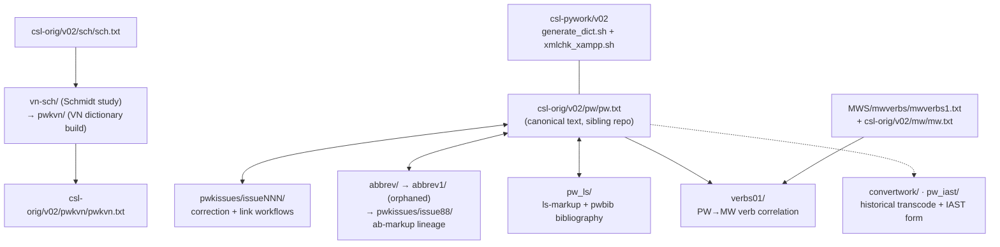

# PWK pipelines — operator manual

_Created: 11-07-2026 · Last updated: 11-07-2026_

This is the **operator manual** for the PWK repository: how to run, verify, and
extend its correction, link-target, bibliography, abbreviation, verb and
supplement pipelines without reading the source code first. PWK is not one
pipeline — it is a family of workspaces over **one shared idiom** (snapshot →
change files → `updateByLine.py` → validate → install → batched delivery), and
this manual is organised around that idiom.

Three documents describe this repo, with different jobs:

- **What the repo is** (history, issue taxonomy, contributors) —
  [readme.md](https://github.com/sanskrit-lexicon/PWK/blob/main/readme.md);
- **Code contract for AI/code sessions** (directory map, tag table) —
  [CLAUDE.md](https://github.com/sanskrit-lexicon/PWK/blob/main/CLAUDE.md);
- **How to operate the pipelines** (this document) —
  [docs/PIPELINE_MANUAL.md](https://github.com/sanskrit-lexicon/PWK/blob/main/docs/PIPELINE_MANUAL.md).

Command sequences below are quoted **verbatim from the in-repo `readme` notes**
of each workspace (the same notes the original operators ran from); paths were
verified to exist in the tree on 11-07-2026. A full end-to-end re-run was not
attempted — several pipelines are one-time-historical and overwrite the sibling
`csl-orig` working tree (see the [lifecycle table](#lifecycle--which-pipelines-are-live)).

## Cheat-sheet: the universal correction loop

Every live workflow in this repo is an instance of this loop. Commands assume
the [environment](#environment-and-prerequisites) below; `$ORIG` =
`csl-orig/v02/pw/pw.txt`, `$PYWORK` = `csl-pywork/v02`.

```sh
# 0. Snapshot the canonical text (never edit $ORIG in place)
cp $ORIG temp_pw_0.txt                     # or pin a commit:
git show <commit>:v02/pw/pw.txt > temp_pw_0.txt

# 1. Produce a change file (three ways)
python corr_to_change.py temp_pw_0.txt corrections_1.txt change_1.txt   # from a corrections list
python diff_to_changes_dict.py temp_pw_0.txt temp_pw_1.txt change_1.txt # from a hand-edited copy
#   ...or a pipeline generator (unmarked_ab.py, lsfix2.py, change_althws.py, ...)

# 2. Apply it — the universal transaction tool
python updateByLine.py temp_pw_0.txt change_1.txt temp_pw_1.txt

# 3. Validate: copy into csl-orig, regenerate displays, XML-check, RESTORE
cp temp_pw_1.txt $ORIG
cd $PYWORK
sh generate_dict.sh pw  ../../pw
sh xmlchk_xampp.sh pw            # expect "ok"
cd - && git -C <csl-orig> restore v02/pw/pw.txt   # if this was only a validation run

# 4. Deliver — NEVER push to csl-orig directly (see Delivery below)
```

**The change-file format** (UTF-8, even number of lines, `;` = comment;
line numbers are 1-based positions in the INPUT file):

```
NNN old <exact current text of line NNN>
NNN new <replacement text>
```

`updateByLine.py` also supports `ins` (insert after line NNN) and `del`
(delete). It aborts on the slightest `old`-text mismatch — that strictness is
the safety property, not a bug. Because `ins`/`del` shift line numbers,
classic passes deliberately **preserve the line count** and chain multiple
change files (`temp_pw_1 → temp_pw_2 → ...`) instead of writing one clever one.

## Map of the workspaces



### Lifecycle — which pipelines are live

| Workspace | What it is | Status |
|---|---|---|
| [pwkissues/](https://github.com/sanskrit-lexicon/PWK/tree/main/pwkissues) | one folder per GitHub issue; correction + link-target workflows | **Live pattern** — every new issue gets a folder |
| [pw_ls/pwbib/](https://github.com/sanskrit-lexicon/PWK/tree/main/pw_ls/pwbib) | bibliography ↔ citation reconciliation | **Re-runnable**; display step dormant since 2016; Jachertz layer reopened 2026 |
| [pw_ls/pw_dhaval/](https://github.com/sanskrit-lexicon/PWK/tree/main/pw_ls/pw_dhaval) | `<ls>` citation inventory extractor (feeds pwbib) | Re-runnable (`makeabbrv.sh`) |
| [verbs01/](https://github.com/sanskrit-lexicon/PWK/tree/main/verbs01) | PW verb → MW verb correlation + preverb analysis | Re-runnable (`redo.sh`) |
| [abbrev/](https://github.com/sanskrit-lexicon/PWK/tree/main/abbrev) → [abbrev1/](https://github.com/sanskrit-lexicon/PWK/tree/main/abbrev1) | `<ab>` abbreviation markup passes (issue [#88](https://github.com/sanskrit-lexicon/PWK/issues/88)) | Historical; **abbrev1 explicitly orphaned 15-08-2023**, work moved to [pwkissues/issue88/](https://github.com/sanskrit-lexicon/PWK/tree/main/pwkissues/issue88) |
| [pwkvn/](https://github.com/sanskrit-lexicon/PWK/tree/main/pwkvn) | building the PWKVN supplement dictionary from Malten's typing (issues [#86](https://github.com/sanskrit-lexicon/PWK/issues/86)/[#87](https://github.com/sanskrit-lexicon/PWK/issues/87)) | One-time historical (2022); install recipe re-runnable |
| [vn-sch/](https://github.com/sanskrit-lexicon/PWK/tree/main/vn-sch) | Schmidt-vs-VN feasibility study + `sch.txt` refinement (issues [#74](https://github.com/sanskrit-lexicon/PWK/issues/74)/[#77](https://github.com/sanskrit-lexicon/PWK/issues/77)) | One-time historical (2021–22) |
| [convertwork/](https://github.com/sanskrit-lexicon/PWK/tree/main/convertwork) | original HK→SLP1 conversion of `pw_orig` | One-time historical (2014, **Python 2 only**) |
| [pw_iast/](https://github.com/sanskrit-lexicon/PWK/tree/main/pw_iast) | IAST-spelling crowdsourcing form (1500+ cases) | Data drop, no scripts; open crowdsourcing |
| [prefaces/](https://github.com/sanskrit-lexicon/PWK/tree/main/prefaces) | vol-1 front-matter OCR + EN/RU translations | Done 06-2026; see [prefaces/README.md](https://github.com/sanskrit-lexicon/PWK/blob/main/prefaces/README.md) |

## Environment and prerequisites

- **Python 3** for everything except `convertwork/` (frozen Python 2). Almost
  all scripts are stdlib-only; **`lxml`** is needed only by
  `pw_ls/pw_dhaval/` (`pip install lxml`).
- **Git Bash / POSIX shell** for the `redo*.sh` drivers and `diff`-based
  invertibility checks.
- **Sibling checkouts.** The notes assume the historical two-root XAMPP layout:
  `/c/xampp/htdocs/sanskrit-lexicon/PWK` beside `/c/xampp/htdocs/cologne/{csl-orig, csl-pywork, csl-websanlexicon, csl-apidev}`.
  On a current GitHub-flat checkout (everything under one `GitHub/` dir), the
  remapping is mechanical: `sanskrit-lexicon/pwk` → `GitHub/PWK`,
  `cologne/csl-orig` → `GitHub/csl-orig`, etc. **The absolute `/c/xampp/...`
  paths inside the readmes are not literal on a modern host** — only the
  relative structure matters. Watch for two coexisting relative conventions in
  `verbs01/redo.sh` (`../../../cologne/csl-orig/...`) vs older notes
  (`../../mw/mw.txt` from the era when the workspace lived inside csl-orig).
- **The repo-name trap:** the dictionary code is `pw`, and it lives in repo
  **PWK** (there is no "PW" repo); `generate_dict.sh pw`, `v02/pw/pw.txt`,
  but `github.com/sanskrit-lexicon/PWK`.
- No secrets, no network access (except `pw_ls/pw_dhaval/pwxml_init.sh`, which
  curls `pwxml.zip` from the Cologne scans server).

## Delivery — the batched-PR rule (read before installing anything)

Historical readmes in this repo end with "commit and push csl-orig" — that was
the maintainers' pattern. **Agent/operator sessions today must not do that.**
Per the org-level rule and the canonical
[correction workflow](https://github.com/sanskrit-lexicon/csl-corrections/blob/main/docs/correction-workflow.md):
prepare and XML-validate corrections locally, park each in the queue
(`/cologne-correction-queue`), and ship everything as **one consolidated PR to
csl-orig at most ~monthly** (`/cologne-batch-pr`). Change files kept in this
repo are the audit trail. Direct pushes to csl-orig are reserved for the
upstream maintainers (Jim/Dhaval).

## Walkthrough 1 — a classic text correction (`pwkissues/issueNNN/`)

The live pattern for any new correction issue. Model folders:
[pwkissues/issue88/](https://github.com/sanskrit-lexicon/PWK/tree/main/pwkissues/issue88)
(abbreviations, the largest) and
[pwkissues/issue106/](https://github.com/sanskrit-lexicon/PWK/tree/main/pwkissues/issue106)
(alternate headwords). The folder index with one-line purposes is
[pwkissues/readme.txt](https://github.com/sanskrit-lexicon/PWK/blob/main/pwkissues/readme.txt).

1. **Create `pwkissues/issueNNN/`**, copy in the standard toolkit from any
   recent folder: `updateByLine.py`, `diff_to_changes_dict.py`, `digentry.py`.
2. **Snapshot** — `cp $ORIG temp_pw_0.txt` (record the csl-orig commit hash in
   your `readme.txt`, as issue88 does), or pin exactly:
   `git show <hash>:v02/pw/pw.txt > temp_pw_0.txt`.
3. **Generate → apply change files** per the cheat-sheet loop, one numbered
   `temp_pw_N.txt` per pass. `temp_pw_*.txt` are **gitignored working files**;
   only `change_*.txt`, logs and the readme are committed — the change files
   ARE the deliverable audit trail.
4. **Validate** with the issue folder's `redo*.sh` if present
   (issue106's `redolocal.sh` copies the temp into csl-orig, runs
   `generate_dict.sh pw ../../pw` + `xmlchk_xampp.sh pw`, then **`git restore
   pw.txt`** so the validation run never accidentally lands). issue88
   additionally maintains a parallel Andhrabharati stream
   (`temp_pw_ab_N.txt`, `redo_dev.sh` vs `redo_prod.sh`) — two dev streams
   whose endpoints must agree.
5. **Document** every command you actually ran in the folder's `readme.txt`,
   with counts (the existing readmes' `# 6496 changes` style is what makes
   this manual possible).
6. **Deliver** per the batched-PR rule above. A tooltip-bearing pass also
   updates the csl-pywork input (e.g. `distinctfiles/pw/pywork/pwab/pwab_input.txt`)
   and, when display PHP changes, the `basicadjust.php` copy in csl-apidev —
   see [/cologne-fork-sync-check](https://github.com/gasyoun/claude-config/blob/main/commands/cologne-fork-sync-check.md)
   for that sync.

## Walkthrough 2 — link targets (two halves)

### 2a. Scan page-index → `index.js` ([pwkissues/issue84/](https://github.com/sanskrit-lexicon/PWK/tree/main/pwkissues/issue84), MBH Bombay)

Research the source PDF's page structure into per-volume TSV indexes
(`vol page parva adhy. from-v. to-v. ipage optional-remark`), then:

```sh
python make_index_orig.py indexes index_orig.txt   # concat per-volume TSVs (6519 cases)
python make_index.py index_orig.txt index.txt      # apply corrections
python make_js_index.py index.txt index.js         # build + consistency-check the JS index
```

`index.js` is consumed by the scan viewer apps and by `basicadjust.php` link
resolution across pw/pwg/pwkvn/sch/mw. `make_js_index.py` validates internal
consistency and reports the record count — treat any drop from the input count
as an error to chase, not noise.

### 2b. Splitting non-standard `<ls>` refs ([pwkissues/issue83fix/](https://github.com/sanskrit-lexicon/PWK/tree/main/pwkissues/issue83fix), Rāmāyaṇa Gorresio/Schlegel)

`lsfix2.py` (needs siblings `lsfix2_parm.py` + `digentry.py`; first argument
is an abbreviation-family code defined in `lsfix2_parm.py`, e.g. `pwga` = "R.
GORR."):

```sh
python lsfix2.py pwga temp_pwg_0.txt lsfix2_pwg_0_a.txt
# report: (False,1),(None,43),(True,7071),(fixed,4),(all,7119)
cp temp_pwg_0.txt temp_pwg_1.txt        # hand-edit the (None,...) unresolved cases
python lsfix2.py pwga temp_pwg_1.txt lsfix2_pwg_1_a.txt
python dict_replace2.py temp_pwg_1.txt lsfix2_pwg_1_a.txt temp_pwg_2.txt   # apply (fixed,...) rows
# validate via generate_dict.sh + xmlchk, then document:
python diff_to_changes_dict.py temp_pwg_0.txt temp_pwg_1.txt change_pwg_1.txt
python diff_to_changes_dict.py temp_pwg_1.txt temp_pwg_2.txt change_pwg_2.txt
```

Read the tuple report as: `True` = already-standard refs, `None` = unresolved
(manual work), `fixed` = machine-replaceable, `False` = errors. The issue83fix
readme orchestrates this across all five koshas (pwg, pw, pwkvn, sch, mw).

## Walkthrough 3 — the bibliography pipeline ([pw_ls/pwbib/](https://github.com/sanskrit-lexicon/PWK/tree/main/pw_ls/pwbib))

**Goal:** reconcile the digitized PW bibliography (Malten 2003, from the six
volumes' "Verzeichniss" pages) against the `<ls>` citations actually occurring
in `pw.txt`, toward clickable bibliography tooltips/links.

**File lineage (the spine to memorise):**

```
pwbib_orig.txt (Malten, cp1252) → pwbib_utf8.txt → pwbib0.txt (hand-regularised, issue #14)
  → pwbib1.py → pwbib1.txt
  → crefmatch.py × sortedcrefs.txt (citation inventory from pw_dhaval)
      → crefmatch.txt + pwbib_new.txt + pwbib_unused.txt + pwbib_abbrv_all.txt
      → mergebibnew.py → mergebibnew.txt (canonical merged bibliography)
      → sortbib.py → displayprep/sortbib.txt (sqlite/display input — never deployed)
```

**Re-run** (from
[pw_ls/pwbib/redo.sh](https://github.com/sanskrit-lexicon/PWK/blob/main/pw_ls/pwbib/redo.sh);
prerequisite: a fresh `sortedcrefs.txt` from `pw_dhaval/makeabbrv.sh`, which
needs `lxml` and a `pwxml` checkout):

```sh
python pwbib1.py pwbib0.txt pwbib1.txt
python crefmatch.py pwbib1.txt ../pw_dhaval/abbrvwork/abbrvoutput/sortedcrefs.txt \
  crefmatch.txt pwbib_new.txt pwbib_unused.txt > crefmatch_log.txt
# then in pwbib_new_work/: mergebibnew.py, properrefs1.py, bibnew_disp1/2.py
# then in displayprep/:    python sortbib.py ../pwbib_new_work/mergebibnew.txt sortbib.txt
```

**Current reconciliation state (verified 11-07-2026):**
`bibminuscref.txt` and `crefminusbib.txt` — the two gap files that drove the
2016 correction series (issues
[#18](https://github.com/sanskrit-lexicon/PWK/issues/18)–[#59](https://github.com/sanskrit-lexicon/PWK/issues/59))
— are both **empty**: every citation abbreviation is matched. The live residue
is **~287 bibliography stubs with no title** (abbreviations PW cites but never
listed), which is what the **Jachertz backfill** attacks:
[pw_ls/pwbib/jachertz/](https://github.com/sanskrit-lexicon/PWK/tree/main/pw_ls/pwbib/jachertz)
parses Jachertz's 1983 Magisterarbeit into `jachertz_bib.tsv` (1,169 entries)
and emits **candidate** matches — `jachertz_parse.py` against the frozen
`mergebibnew.txt` stubs, `jachertz_parse2.py` against the **live**
`csl-pywork/.../pwauth/pwbib_input.txt` (352 unresolved as of 24-10-2025).
Both outputs are review candidates awaiting maintainer approval
([PRs #126](https://github.com/sanskrit-lexicon/PWK/pull/126),
[#129](https://github.com/sanskrit-lexicon/PWK/pull/129)); **nothing is
applied to canonical data automatically**, and stub titles, once approved, are
fixed at source (`pwbib_new.txt`) — never in the generated `mergebibnew.txt`.

## Walkthrough 4 — abbreviation markup lineage (issue [#88](https://github.com/sanskrit-lexicon/PWK/issues/88))

Three generations; **only the last is where new work goes**:

1. [abbrev/](https://github.com/sanskrit-lexicon/PWK/tree/main/abbrev)
   (06-2022): `freq_ab.py` census → `unmarked_ab.py` (plain, 6,496 changes) →
   `unmarked_ab_italic.py` (inside ``, 10,450 changes), each applied via
   `updateByLine.py` with `generate_dict`/`xmlchk` validation between passes.
2. [abbrev1/](https://github.com/sanskrit-lexicon/PWK/tree/main/abbrev1)
   (08-2023): adds the Andhrabharati reconciliation and `redo_dev.sh` dev
   builds — **orphaned 15-08-2023** (banner at the top of its
   [readme.txt](https://github.com/sanskrit-lexicon/PWK/blob/main/abbrev1/readme.txt);
   the bottom half of that readme is pasted OLD notes from `abbrev/` — do not
   re-run them from there).
3. [pwkissues/issue88/](https://github.com/sanskrit-lexicon/PWK/tree/main/pwkissues/issue88)
   — the living continuation, with the dual CDSL/AB temp streams and the
   `ablists/` AB abbreviation lists.

The census tool is reusable for any new pass:
`python freq_ab.py temp_pw_N.txt temp_pwab_input.txt freq_ab_N.txt` — compare
before/after snapshots to prove your pass changed only what it claimed.

## Walkthrough 5 — verbs01 (PW ↔ MW verb correlation)

Prerequisite: the MW verb inventory `mwverbs1.txt` **pre-built in the sibling
[MWS](https://github.com/sanskrit-lexicon/MWS) repo** (`MWS/mwverbs/`). Then
([verbs01/redo.sh](https://github.com/sanskrit-lexicon/PWK/blob/main/verbs01/redo.sh),
run from `verbs01/`):

```sh
orig="../../../cologne/csl-orig/v02"
mwverbs1="../../MWS/mwverbs/mwverbs1.txt"
python pw_verb_filter.py ${orig}/pw/pw.txt pw_verb_exclude.txt pw_verb_include.txt pw_verb_filter.txt
python pw_verb_filter_map.py pw_verb_filter.txt pw_mw_map_edit.txt ${mwverbs1} pw_verb_filter_map.txt
python preverb1.py slp1 ${orig}/pw/pw.txt pw_verb_filter_map.txt ${mwverbs1} pw_preverb1.txt
```

Stage 1 filters `pw.txt` to verb/root entries by pattern codes with
empirical include/exclude overrides (2,819 verbs); stage 2 maps each to an MW
root (`pw_mw_map_edit.txt` + 200-odd hardcoded special correspondences; 95
unmatched become `mw=?`); stage 3 analyses upasarga prefixation and matches
prefixed PW verbs to MW (5,767 yes / 1,624 no in the committed
`pw_preverb1.txt`). The hand-curated lists are the valuable part — extend
them, don't regenerate them.

## Walkthrough 6 — the PWKVN supplement ([pwkvn/](https://github.com/sanskrit-lexicon/PWK/tree/main/pwkvn), historical)

How a **new Cologne dictionary was built** from Thomas Malten's cp1252 typing
of the *Nachträge und Verbesserungen* (all 7 volumes) — kept operational here
because the install recipe is the org's template for standing up a dictionary:

- **`orig/`** — 29 successive cp1252 editions (`pwk1-7VN_ansi_0..28.txt`),
  lineage in [pwkvn/orig/readme.txt](https://github.com/sanskrit-lexicon/PWK/blob/main/pwkvn/orig/readme.txt).
- **`step0/`** — the transformation chain v9→v28, one subdir per concern:
  `lsprep1..4` (`<ls>` markup + AS→IAST), `wide`, `slp` (HK→SLP1 +
  `<hw>`/`<hom>`), `meta` (metalines), `page299` (the 50 entries missing from
  vol 1 p. 299), `german`/`german1`, `final` (alternate headwords, bijective
  hk↔slp1 `final.py`, `pwkvn_hwextra.txt`, `<ab>` init), `lsnum`. Every
  encoding stage asserts a **zero-diff round-trip**
  (`python final.py hk,slp1 ... ; python final.py slp1,hk ... ; diff | wc -l` → 0).
- **`step1/althws/`** — post-install alternate-headword revision (issues
  [#86](https://github.com/sanskrit-lexicon/PWK/issues/86)/[#87](https://github.com/sanskrit-lexicon/PWK/issues/87))
  via `change_althws.py` + `updateByLine.py`.
- **`install/`** —
  [pwkvn/install/readme.txt](https://github.com/sanskrit-lexicon/PWK/blob/main/pwkvn/install/readme.txt):
  convert the chosen `orig` edition (`cp1252_utf8.py` → `final.py hk,slp1`),
  `cp` into `csl-orig/v02/pwkvn/pwkvn.txt` + `pwkvn_hwextra.txt` +
  `pwkvn-meta2.txt` + `pwkvnheader.xml`, then register the dictionary in
  csl-pywork (`dictparms.py`, `make_xml.py`, `redo_*_all.sh`),
  csl-websanlexicon (`dictparms.py`, `distinctfiles/pwkvn/`, `dictinfo.php`,
  `basicadjust.php`, `dal.php`) and csl-apidev — the full multi-repo
  checklist is in that readme. PWKVN reuses the PW scan images.

## Walkthrough 7 — the remaining workspaces (historical, read-only)

- **[vn-sch/](https://github.com/sanskrit-lexicon/PWK/tree/main/vn-sch)** —
  the 2021–22 feasibility study: refine `sch.txt` to Cologne conventions
  (`step1/redo.sh`, eight chained change passes; the hand-made `change1.txt` /
  `change6.txt` are prerequisites, not generated), extract PW-VN candidate
  records (`step2/redo.sh`, with slp1/deva invertibility checks), and compare
  Schmidt against a 10-page PWK-VN sample (`step3/redo.sh`). Its refined
  `temp_sch8.txt` shipped as csl-orig `sch.txt`; its conclusion fed the
  decision to digitize VN properly (→ pwkvn). Inputs are pinned to csl-orig
  commits (`git show 1c933cc...:./sch.txt`), so it stays reproducible.
- **[convertwork/](https://github.com/sanskrit-lexicon/PWK/tree/main/convertwork)** —
  the 2014 one-time HK→SLP1 conversion of `pw_orig` (`transcode.py`,
  **Python 2 only**, invoked as `python26`); its `difforig` records the 64
  known round-trip imperfections. Do not port; do not re-run.
- **[pw_iast/](https://github.com/sanskrit-lexicon/PWK/tree/main/pw_iast)** —
  a scripts-free crowdsourcing drop: the 1,500-case IAST-spelling correction
  form (`pwis_notmw3_correctionform.txt`; contributors fill
  `Correction_SLP1=`, or `OK`). Application tooling lives outside this folder.

## Symptom → cause → cure

| Symptom | Cause | Cure |
|---|---|---|
| `updateByLine.py`: `CHANGE ERROR #2: Old mismatch` | The `old` line text doesn't byte-match the input (wrong base snapshot, stale line numbers after an `ins`/`del`, BOM at file start) | Re-snapshot from the exact commit your change file was built against; regenerate the change file; check `head -c 3 | xxd` for a BOM |
| Change file rejected / weird pairing errors | Odd number of lines, or a non-`;` stray line | Every transaction is a pair (`old`+`new`, or `ins`/`del` forms); comments start with `;` |
| A `readme.txt` command fails with `/c/xampp/htdocs/...: No such file` | Historical XAMPP absolute paths | Remap mentally to your flat checkout (`cologne/csl-orig` → sibling `csl-orig`, `sanskrit-lexicon/pwk` → this repo); only the structure matters |
| `verbs01/redo.sh` can't find `mw.txt` or `mwverbs1.txt` | Two path-era conventions coexist; MW inventory not built | Run from inside `verbs01/`; build/fetch `MWS/mwverbs/mwverbs1.txt` first |
| `xmlchk` fails after your pass | Your change broke tag pairing (`<ab>`, `<ls>`, `<is>`) | Diff the failing records (`generate_dict.sh` output names them); the abbrev1 `corrections_ab_0.txt` file is a catalogue of what malformed markup looks like |
| `csl-orig` left dirty after a validation run | `redo_dev.sh`-style scripts copy into `$ORIG` and restore afterwards; an abort mid-run skips the restore | `git -C <csl-orig> status` after every validation; `git restore v02/pw/pw.txt` |
| `lsfix2.py`: `NameError`/import failure | `lsfix2_parm.py` or `digentry.py` missing beside it | Copy the trio together; the parm file defines the abbreviation-family codes |
| Fuzzy/pwbib matcher output shrank drastically | `crefmatch.py` has ~15 hardcoded per-abbreviation fixups + MBH special-casing | Maintain that `changes` list by hand when abbreviations change; it's brittle by design |
| Mojibake (ä, °) in a Malten-derived file | cp1252 source read as UTF-8 | The `cp1252_utf8.py`/`utf8_cp1252.py` pair is bijective — convert, never re-save from an editor |
| `convertwork/transcode.py` syntax errors | Python 2 script | Historical; do not run under Python 3 |
| Extended-ASCII confusables in pwkvn data (`£`, `º`, `²`, `·`) | Malten typing conventions | They are **semantic**: `£` = udātta accent, `º` must normalise to `°`, `²` = line break, `·` = line break (vn-sch); see [pwkvn/step0/readme.txt](https://github.com/sanskrit-lexicon/PWK/blob/main/pwkvn/step0/readme.txt) before "fixing" any of them |

## Glossary

| Term | Meaning here |
|---|---|
| PW / PWK | Böhtlingk's *Sanskrit-Wörterbuch in kürzerer Fassung* (7 vols, 1879–89). Dictionary code `pw`; repo name PWK |
| VN / PWKVN | the *Nachträge und Verbesserungen* (addenda & corrigenda) printed with PW; digitized as the separate CDSL dictionary `pwkvn` |
| Schmidt / SCH | Richard Schmidt's *Nachträge zum Sanskrit-Wörterbuch* — the other supplement, compared against VN in `vn-sch/` |
| AB / Andhrabharati | Nagabhushana Rao's independent digitization of PW, reconciled against the Cologne text in issue88-era work |
| `<ls>` | literary-source citation tag — the object of link-target, splitting and bibliography work |
| `<ab>` / `pwab_input.txt` | abbreviation tag / its tooltip source in csl-pywork |
| change file / transaction | the `NNN old` / `NNN new` pair format consumed by `updateByLine.py` |
| `temp_pw_N.txt` | numbered, gitignored working snapshots; the audit trail is the change files, not the temps |
| AS | the letter-number transliteration in Malten's typing (e.g. `A7`, `S2`), converted to IAST/SLP1 by the `transcoder.py` tables |
| pwbib | the digitized PW bibliography and its reconciliation pipeline in `pw_ls/pwbib/` |
| Jachertz | Thomas Jachertz's 1983 Magisterarbeit resolving which editions PW quotes — the 2026 backfill source for title-less bibliography stubs |
| `sortedcrefs.txt` | the canonical `<ls>` citation inventory extracted from `pw.xml` by `pw_ls/pw_dhaval/` |
| `generate_dict.sh` + `xmlchk_xampp.sh` | the csl-pywork build-and-validate pair every install runs |

## Maintainer appendix

### The shared engine is vendored, not imported

`updateByLine.py` (~163 lines) exists as **~18 copies** across the workspaces
(abbrev, pw_ls, most `pwkissues/issueNNN/`, pwkvn/step0 + step1, vn-sch);
`parseheadline.py`, `digentry.py` and the 411-line `transcoder.py` (+ per-dir
XML rule tables) are likewise copy-vendored per folder. This is deliberate
(each issue folder is a frozen, self-contained record), but it means a bug fix
in one copy fixes nothing anywhere else — when touching one, check its
siblings, and prefer the newest issueNNN copy as the reference version.

### Encoding discipline is the spine

Three encodings flow through the repo — cp1252 (Malten typing) ⇄ UTF-8 ⇄
SLP1/HK/IAST — and every historical stage that crossed one of those boundaries
asserted a **zero-diff round-trip** before proceeding
(`convert → invert → diff | wc -l` must print 0). Any new transform you add
must keep that habit; the two known sanctioned imperfections are documented
(`convertwork/difforig`, 64 lines; the vn-sch extract1↔extract2 capital-IAST
loss, fully explained by `compare_roman1.py`).

### Known traps and observed defects

1. **`abbrev1/readme.txt` is a landmine**: orphan banner on top, but the
   bottom half is pasted obsolete commands from `abbrev/`. New abbreviation
   work belongs in `pwkissues/issue88/`.
2. **Validation scripts mutate csl-orig** and restore on success only —
   an aborted `redo_dev.sh`/`redolocal.sh` leaves the sibling repo dirty
   (symptom table).
3. **`crefmatch.py` hardcodes abbreviation fixups**; `pw_verb_filter_map.py`
   hardcodes 200+ PW→MW correspondences — empirical knowledge lives in code,
   so treat those blocks as data to extend, never to "clean up".
4. **Two path-era conventions coexist** (`verbs01` readme vs its `redo.sh`);
   trust the `redo.sh`, which was rewired to the sibling-repo layout.
5. **The pwbib display layer was never deployed** — `sortbib.txt` +
   `bibnew_disp*` (2016) await the `webtc/disp.php` wiring; 16 duplicate
   abbreviations flagged in `sortbib_log.txt` would need disambiguating first.
6. **Stray artifacts** exist and are harmless: `pw_ls/pwbib/sh` (a captured
   directory listing, not a script), `~`-suffix editor backups, a stale
   0-byte `verbs01/preverb1_tempupa.txt`, and the misnamed
   `pwkvn/step0/lsprep4/compare_28_pwunused.txtpython`.
7. **`pwkvnheader.xml` was installed empty** (a `touch`), by design of the
   2022 install; if header metadata is ever wanted, that's a csl-orig change.
8. **Line-number semantics**: change files address the *input* file; `ins`/
   `del` shift subsequent numbers — the readmes' habit of one concern per
   change file and preserved line counts is load-bearing, keep it.

Improvement backlog, provenance and revision history live in the companion
metadoc:
[docs/PIPELINE_MANUAL.meta.md](https://github.com/sanskrit-lexicon/PWK/blob/main/docs/PIPELINE_MANUAL.meta.md).

_Dr. Mārcis Gasūns_
