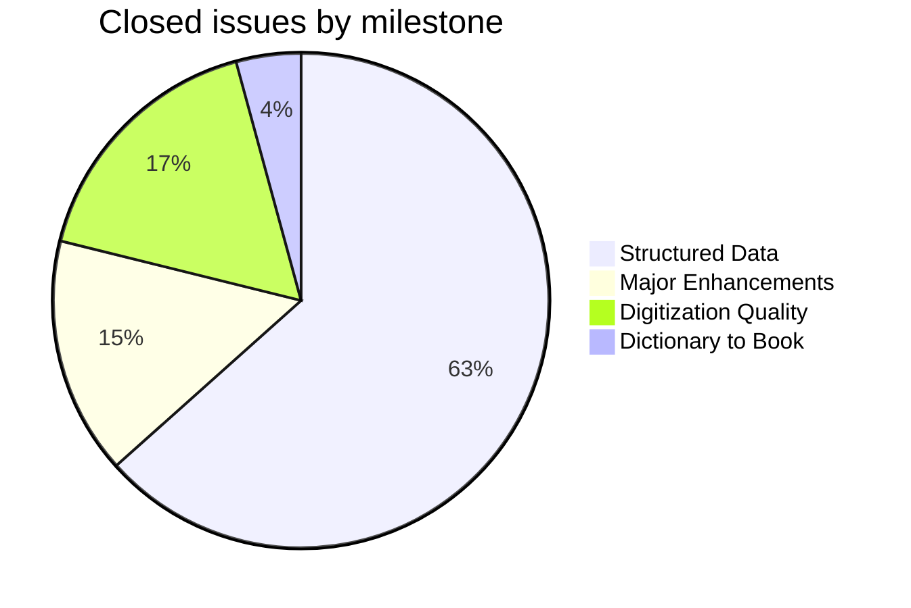
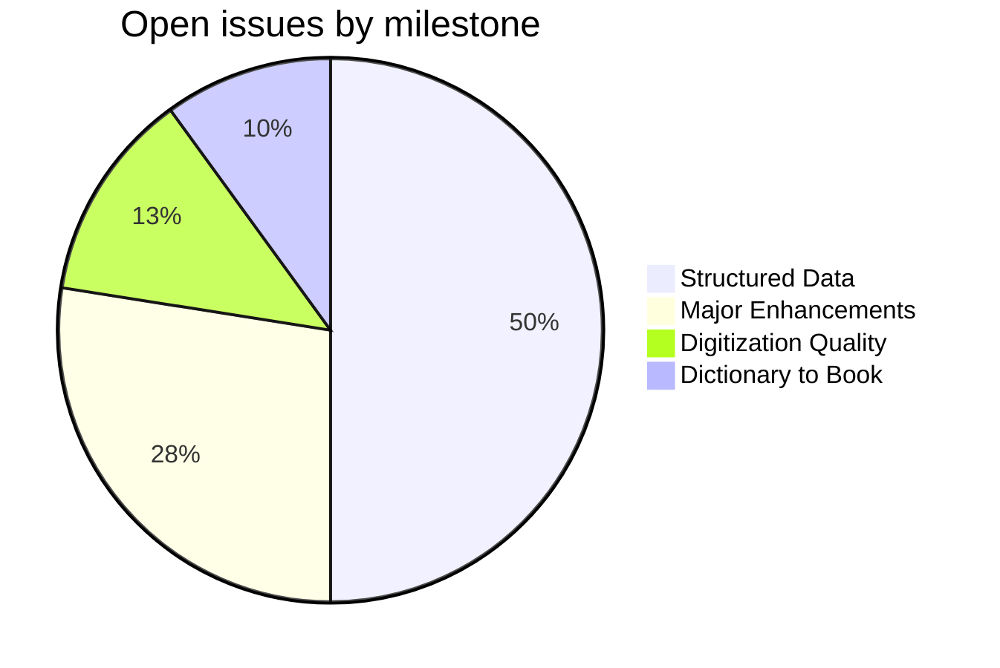
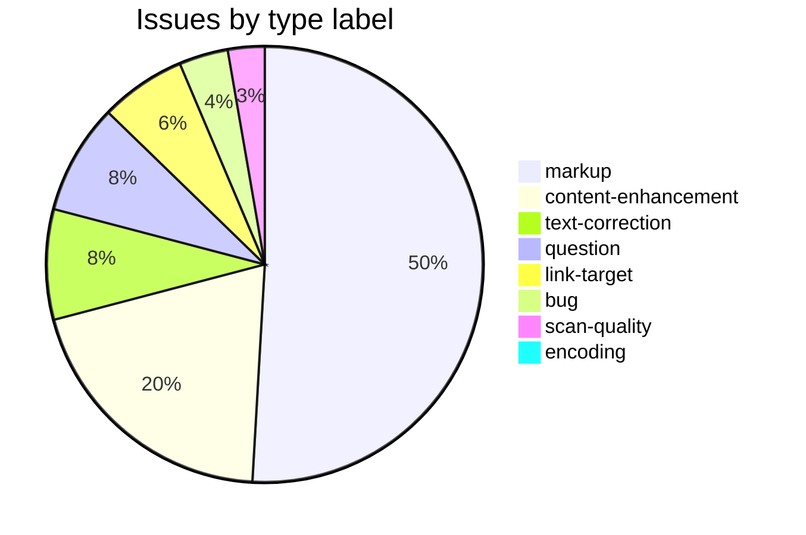

PWK
===

Böhtlingk, Otto; *Sanskrit-Wörterbuch in kürzerer Fassung*, 7 Bände. St. Petersburg, 1879–1889.

This repository holds corrections, enhancements, and tooling for the [Cologne digitization](http://www.sanskrit-lexicon.uni-koeln.de/) of the PWK dictionary. The canonical source data (`pw.txt` in SLP1 encoding) lives in [csl-orig](https://github.com/sanskrit-lexicon/csl-orig); the build system is in [csl-pywork](https://github.com/sanskrit-lexicon/csl-pywork). Issues and corrections are tracked at the [PWK GitHub issue tracker](https://github.com/sanskrit-lexicon/PWK/issues).

## Contents

| Directory | Description |
|-----------|-------------|
| `pw_ls/` | Bibliography and literary-source analysis: `pwbib*.txt` tables, `crefmatch.py`, fuzzy-match pipelines |
| `pwkissues/` | Per-issue correction workflows and documentation (`issueNNN/` pattern) |
| `abbrev/` | General abbreviation (`<ab>`) markup pipeline |
| `convertwork/` | SLP1 ↔ HK transcoding utilities |
| `verbs01/` | PW verb identification and correlation with MW verbs |
| `pwkvn/` | PWKVN (variant supplement) data — `step0/`, `step1/`, `install/` |
| `vn-sch/` | VN vs. Schmidt comparison and correction work |
| `pw_iast/` | IAST transcoding of `pw.txt` |
| `prefaces/` | Front-matter OCR (title page, *Vorwort*, *Verzeichniss der citirten Werke*) with English + Russian translations — see below |

## Front matter (`prefaces/`)

Faithful OCR of the five front-matter scan pages of vol. 1 (*Erster Theil — Die Vocale*, St. Petersburg 1879), each in the German source plus English and Russian translations, with consolidated single-file editions and a [`prefaces/README.md`](prefaces/README.md) index. Source: the Cologne [csldoc preface scans](https://sanskrit-lexicon.uni-koeln.de/scans/csldev/csldoc/build/dictionaries/prefaces/pwpref.html). The *Verzeichniss* is a 304-entry bibliographic key list (100 + 106 + 98). Böhtlingk's romanization is preserved as printed (`â î û` = long vowels, `ç` = ś, `sh` = ṣ, `j` = y, `ḱ` = c, `ǵ` = j); Devanāgarī and Vikrama-Saṃvat dates (e.g. *Benares 1921*) are kept verbatim. The Foreword sign-off (*Jena, den 1sten Mai 1879. — O. Böhtlingk.*) is preserved; digitizer header/footer stamps are omitted.

<strong>OCR run notes (2026-06-17)</strong> — cost, timing, and technical lessons

Produced by the `/cologne-preface-ocr` skill (vision OCR + translation subagents). Process retrospective, not part of the deliverable.

**Cost.** Subagents (exact, from harness telemetry): 6 agents, ≈413,100 output tokens, 89 tool calls — OCR page 4 (92.6k / 40 calls / 356 s), OCR page 5 (66.3k / 194 s), RU 3–5 (77.3k / 199 s), EN 3–5 (76.6k / 184 s), RU 1–2 (50.7k / 64 s), EN 1–2 (49.6k / 44 s). Main thread (estimate, dominated by ~30 native-resolution image-crop reads): ≈80–120k tokens. **Total ≈500–550k tokens.**

**Time.** Wall-clock ≈18–22 min. The two OCR agents overlapped (gated by the 356 s page-4 agent) and the four translation agents overlapped (gated by the 199 s RU agent); the foreground crop→read loop for pages 1–3 was sequential by nature.

**Technical lessons (reusable):**

1. **Crop boundaries are iterative, not one-shot.** Justified prose lines reach the column edge while list lines don't; set the column `x1` at the **divider** (~x1700 on these 3304-px pages), not at the apparent text edge. Pages 2–3 needed 2–3 re-crops each.
2. **Reverse-engineer the romanization key before the dense pages.** Confirmed `ḱ`=c, `ǵ`=j, `ç`=ś, `j`=y from internal evidence (*Prâjaçḱitta* = Prāyaścitta, *Ǵjotisha* = Jyotiṣa) by zooming individual glyphs — which made it safe to delegate pages 4–5.
3. **Machine-verify completeness; don't trust agent self-reports.** Subagents miscounted their own output (claimed 45/64 entries for page 3 vs. the true 100). A scripted `^\*\*` key-count across source + both translations gave 100/106/98 exact match.
4. **Subagents silently drop "non-list" content.** The page-5 agent omitted the sign-off as "not an entry"; it sits below the columns on the last list page. Always re-add place/date/signature.
5. **Fidelity vs. correctness, resolved by parallel evidence.** *"Benares 1921"* looked wrong but is a real Saṃvat date (kept verbatim); *"Mahâbhâsuja"* looked real but was a scan artifact of *"Mahâbhâshja"* (fixed, confirmed by the adjacent *Mahâbh. (K.)* entry). The discriminator was always another occurrence on the same page.
6. **Encoding.** All 20 `.md` files written UTF-8 **no BOM**; git's LF→CRLF warning on Windows is cosmetic (committed blobs are LF).
7. **Push raced a moved remote** — resolved with an add-only `fetch` + `rebase origin/master` + `push` (conflict-free, all files new).
8. **Repo-name trap:** dict code `pw` lives in repo **PWK**, not "PW".

## Timeline

| Period | Milestone |
|--------|-----------|
| Nov 2014 | Repository initialized; initial SLP1 conversion of PW digitization |
| Nov 2015 | Moved from `sanskrit-lexicon/CORRECTIONS`; bibliography pipeline started in `pw_ls/` |
| 2016 | Bibliography cross-reference series: `bibminuscref` and `crefminusbib` correction batches (issues #18–#59) |
| 2018 | IAST correction form tooling |
| Mar 2020 | `verbs01` verb pipeline — PW verbs correlated with MW (#68) |
| 2021 | PWKVN supplement work: VN vs. Schmidt (#74, #77); LS corrections (#79, #85) |
| Jan–Jun 2022 | Link targets: MBH Bombay edition (#81), Gorresio Ramayana (#90); PWKVN supplement (#86, #87) |
| Jun–Dec 2022 | Abbreviation markup pipeline (`abbrev/`); `<is>` tag cleanup (#88, #91) |
| Aug 2023 | Abbreviation markup continued (issue88 workflow) |
| 2024 | Bot tags (#111); BHĀGAVATAPURĀṆA LS markup (#109, #110); display revisions (#97) |
| Jun–Oct 2025 | MBH Bombay links (#84); Ramayana Gorresio/Schlegel link splitting (#83fix, #83fixa) |
| Jun 2026 | Front-matter OCR + EN/RU translations of vol. 1 prefaces (`prefaces/`) |

## Projects & Milestones

Work is organised into four GitHub Projects (org-level kanban boards), each mirroring a milestone:

| Project | Milestone | Open | Closed | Scope |
|---|---|---|---|---|
| [**Dictionary to Book**](https://github.com/orgs/sanskrit-lexicon/projects/1) | [milestone](https://github.com/sanskrit-lexicon/PWK/milestone/1) | 4 | 3 | Link targets and link splitting |
| [**Digitization Quality**](https://github.com/orgs/sanskrit-lexicon/projects/2) | [milestone](https://github.com/sanskrit-lexicon/PWK/milestone/2) | 5 | 12 | Scan quality, encoding, bug fixes, text corrections |
| [**Structured Data**](https://github.com/orgs/sanskrit-lexicon/projects/3) | [milestone](https://github.com/sanskrit-lexicon/PWK/milestone/3) | 20 | 45 | Markup normalisation, bibliography cross-references, editorial questions |
| [**Major Enhancements**](https://github.com/orgs/sanskrit-lexicon/projects/4) | [milestone](https://github.com/sanskrit-lexicon/PWK/milestone/4) | 11 | 11 | Display upgrades, new data, VN supplement, verb markup |

## Issue Typology

Issues track two broad concerns: **enriching the XML markup** (bibliography, link targets) and **improving the digitization** (encoding, scan quality, text corrections).

#### Solved (closed issues)

| Type | Count | Description | Examples |
|---|---|---|---|
| **Markup** | 41 | Bibliography cross-reference corrections (`bibminuscref`/`crefminusbib` series); `<ls>`, `<ab>`, `<is>` tag normalisation | Correction series [#18](https://github.com/sanskrit-lexicon/PWK/issues/18)–[#59](https://github.com/sanskrit-lexicon/PWK/issues/59), bot tags [#111](https://github.com/sanskrit-lexicon/PWK/issues/111), `<is>` tag [#95](https://github.com/sanskrit-lexicon/PWK/issues/95) |
| **Content enhancement** | 11 | Display upgrades, VN supplement, verb pipeline, new dictionary data | PWKVN supplement [#86](https://github.com/sanskrit-lexicon/PWK/issues/86), verbs01 [#68](https://github.com/sanskrit-lexicon/PWK/issues/68), alternate headwords [#106](https://github.com/sanskrit-lexicon/PWK/issues/106) |
| **Text corrections** | 6 | Corrections to German definitions, Sanskrit headwords, PWKVN revisions | AB revisions [#102](https://github.com/sanskrit-lexicon/PWK/issues/102), [#103](https://github.com/sanskrit-lexicon/PWK/issues/103), LS corrections [#79](https://github.com/sanskrit-lexicon/PWK/issues/79) |
| **Link targets** | 3 | Clickable links from `<ls>` abbreviations to scanned PDF pages | Gorresio Ramayana [#90](https://github.com/sanskrit-lexicon/PWK/issues/90), BHĀGAVATAPURĀṆA PWKVN [#110](https://github.com/sanskrit-lexicon/PWK/issues/110) |
| **Scan quality** | 3 | Missing or poor-quality scans replaced | Better CDSL images [#112](https://github.com/sanskrit-lexicon/PWK/issues/112), pw scans for VN [#107](https://github.com/sanskrit-lexicon/PWK/issues/107) |
| **Bug fixes** | 2 | Broken display, `<pc>` page-column errors | `<pc>` at volume boundary [#94](https://github.com/sanskrit-lexicon/PWK/issues/94), web path [#7](https://github.com/sanskrit-lexicon/PWK/issues/7) |
| **Questions resolved** | 4 | Editorial and scholarly questions researched and answered | Abbreviation in German [#49](https://github.com/sanskrit-lexicon/PWK/issues/49), submission format [#42](https://github.com/sanskrit-lexicon/PWK/issues/42) |
| **Encoding** | 1 | SLP1/IAST transcoding | SLP1 conversion [#9](https://github.com/sanskrit-lexicon/PWK/issues/9) |

#### Open (work ahead)

| Type | Count | Description | Examples |
|---|---|---|---|
| **Markup** | 15 | Bibliography gaps, missing `<ls>` markup, bibliography title improvements | Missing markup [#67](https://github.com/sanskrit-lexicon/PWK/issues/67), LS sequences [#80](https://github.com/sanskrit-lexicon/PWK/issues/80), pwbib titles [#65](https://github.com/sanskrit-lexicon/PWK/issues/65) |
| **Content enhancement** | 11 | Display revisions, PW/PWG LS display, VN7 Schmidt | Display revisions [#97](https://github.com/sanskrit-lexicon/PWK/issues/97), LS display [#96](https://github.com/sanskrit-lexicon/PWK/issues/96), VN7 Schmidt [#75](https://github.com/sanskrit-lexicon/PWK/issues/75) |
| **Link targets** | 4 | Literary sources still needing index and links | BHĀGAVATAPURĀṆA PW [#109](https://github.com/sanskrit-lexicon/PWK/issues/109), MBH Bombay [#84](https://github.com/sanskrit-lexicon/PWK/issues/84), Ramayana [#83](https://github.com/sanskrit-lexicon/PWK/issues/83) |
| **Text corrections** | 3 | Ongoing correction batches | Thomas corrections [#100](https://github.com/sanskrit-lexicon/PWK/issues/100), PWKVN3 vs Schmidt [#77](https://github.com/sanskrit-lexicon/PWK/issues/77), VN page typing [#76](https://github.com/sanskrit-lexicon/PWK/issues/76) |
| **Questions** | 5 | Scholarly questions requiring research | ṚV citations [#98](https://github.com/sanskrit-lexicon/PWK/issues/98), s.u. markup [#66](https://github.com/sanskrit-lexicon/PWK/issues/66), further work [#108](https://github.com/sanskrit-lexicon/PWK/issues/108) |
| **Bug fixes** | 2 | Known display and formatting errors | Abbreviations bracket [#12](https://github.com/sanskrit-lexicon/PWK/issues/12), correction submission [#6](https://github.com/sanskrit-lexicon/PWK/issues/6) |

## Labels

Every issue carries one **type** label and one **severity** label.

#### Type

| Label | Meaning |
|---|---|
| `link-target` | Building a click-through from a `<ls>` abbreviation to scanned PDF pages |
| `link-splitting` | Splitting combined `SOURCE N,N` refs into individual per-page links |
| `markup` | Normalising XML tag content or structure (`<ls>`, `<ab>`, `<lex>`, bibliography cross-references) |
| `text-correction` | Corrections to German definitions, Sanskrit headwords, or orthography |
| `content-enhancement` | New material, display upgrades, or structural additions beyond correction |
| `encoding` | SLP1/AS/IAST transcoding, character rendering, hyphen/dash normalisation |
| `scan-quality` | Replacing blurry, skewed, or missing scan pages |
| `bug` | Broken display, XML structure errors, broken links |
| `question` | Scholarly or editorial questions requiring research before any code change |

#### Severity

| Label | Meaning |
|---|---|
| `minor` | Targeted, self-contained fix — a handful of entries or a single file |
| `medium` | Standard unit of work — one link-target index, a batch of corrections |
| `hard` | Large effort spanning many sources, files, or dictionaries |

## Contributors

- **Jim Funderburk** ([@funderburkjim](https://github.com/funderburkjim)) — primary repository maintainer; tooling and correction workflows
- **drdhaval2785** ([@drdhaval2785](https://github.com/drdhaval2785)) — bibliography cross-reference analysis and correction pipelines
- **Anna Rybakova** ([@AnnaRybakovaT](https://github.com/AnnaRybakovaT)) — PWKVN data entry and corrections
- **Thomas Malten** ([@thomasincambodia](https://github.com/thomasincambodia)) — corrections and headword classifications
- **Mārcis Gasūns** ([@gasyoun](https://github.com/gasyoun)) — initial commit and early data work
- **Andhrabharati** (Nagabhushana Rao) — AB version analysis; LS correction data
